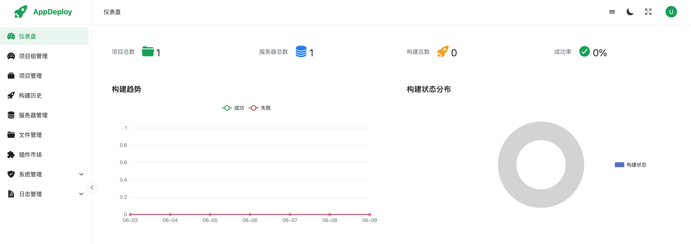
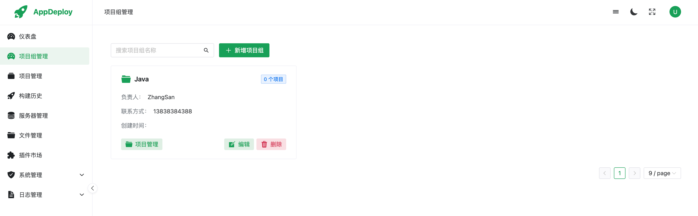
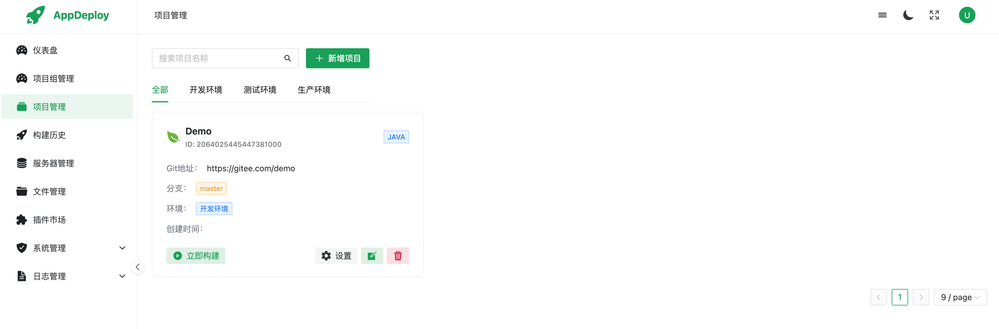
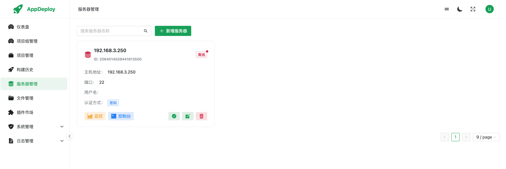
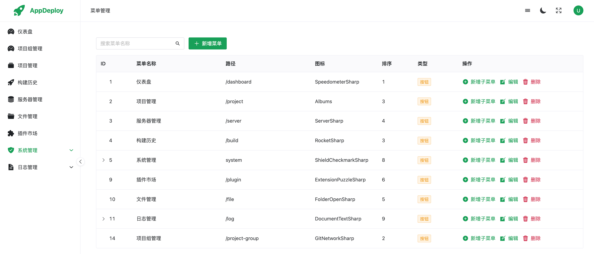
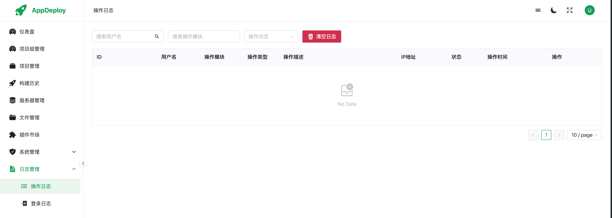
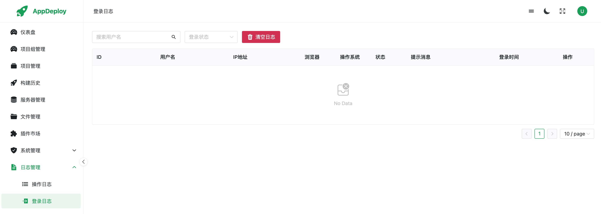

# AppDeploy 项目说明

AppDeploy 是一个面向 Java / Vue 项目的自动化构建、上传、部署平台。系统提供项目管理、服务器管理、构建任务、实时日志、文件管理、服务器监控、插件安装、用户权限、操作审计等能力，适合开发团队和运维人员统一管理应用发布流程。


## 功能特性

- 项目管理：支持 Java、Vue 项目配置，维护 Git 仓库、分支、构建命令、部署路径等信息。
- 项目组管理：支持按业务、组织或团队对项目进行分组。
- 构建部署：支持 Maven、Gradle、npm 等构建方式，一键触发构建与部署。
- 实时日志：通过 WebSocket 实时查看构建日志、项目运行日志和插件安装日志。
- 版本回退：支持基于备份文件进行部署版本回退。
- 服务器管理：支持 SSH 连接测试、服务器状态管理、监控信息查看。
- 文件管理：支持远程服务器文件浏览、上传、批量上传、下载、删除和创建目录。
- 插件市场：支持基础环境和中间件插件安装、卸载、日志查看。
- 用户权限：支持用户、角色、菜单权限管理。
- 审计日志：支持登录日志、操作日志查询和清理。
- 数据看板：提供项目数量、服务器数量、构建数量、成功率、构建趋势和状态分布图表。

## 技术栈

后端：

- Java 17
- Spring Boot 3.2.5
- MyBatis-Plus 3.5.5
- MySQL 8.x
- Redis
- Sa-Token
- Druid
- JGit
- JSch
- WebSocket
- Lombok

前端：

- Vue 3
- Vite 5
- Vue Router
- Pinia
- Axios
- Naive UI
- ECharts
- xterm.js

## 项目结构

```text
app_deploy
├── src/main/java/com/bc/app_deploy
│   ├── config              # Spring / MyBatis-Plus 配置
│   ├── controller          # HTTP 接口
│   ├── exception           # 自定义异常
│   ├── framework           # 框架扩展处理器
│   ├── mapper              # MyBatis-Plus Mapper
│   ├── model               # DTO / DO / VO / 参数对象
│   ├── service             # 业务接口与实现
│   └── utils               # 工具类与 WebSocket
├── src/main/resources
│   └── application.properties
├── app-deploy-ui
│   ├── src/api             # 前端接口封装
│   ├── src/router          # 前端路由
│   ├── src/views           # 页面组件
│   ├── src/utils           # 前端工具
│   └── vite.config.js
├── pom.xml
└── README.md
```

## 环境要求

- JDK 17+
- Maven 3.8+
- Node.js 18+
- MySQL 8.x
- Redis

## 后端配置

配置文件位置：

```text
src/main/resources/application.properties
```

核心配置示例：

```properties
server.port=8181

spring.datasource.url=jdbc:mysql://127.0.0.1:3306/app_deploy?serverTimezone=Asia/Shanghai&useUnicode=true&rewriteBatchedStatements=true&characterEncoding=utf8&useAffectedRows=true
spring.datasource.username=root
spring.datasource.password=Admin123

spring.data.redis.host=127.0.0.1
spring.data.redis.port=6379
spring.data.redis.password=ABC123###
```

启动前需要确认：

- MySQL 已创建 `app_deploy` 数据库。
- 数据库账号、密码与配置一致。
- Redis 服务已启动。
- Redis 密码与配置一致。

## 后端启动

```bash
./mvnw spring-boot:run
```

后端默认访问地址：

```text
http://localhost:8181
```

编译检查：

```bash
./mvnw -DskipTests compile
```

打包：

```bash
./mvnw -DskipTests package
```

## 前端启动

进入前端目录：

```bash
cd app-deploy-ui
```

安装依赖：

```bash
npm install
```

启动开发服务：

```bash
npm run dev
```

前端默认访问地址：

```text
http://localhost:3000
```

生产构建：

```bash
npm run build
```

## 前端代理

前端开发环境通过 Vite 代理访问后端：

```js
server: {
  port: 3000,
  proxy: {
    '/api': {
      target: 'http://localhost:8181',
      changeOrigin: true
    }
  }
}
```

## 主要接口模块

- `/api/auth`：登录、登出、当前用户、菜单权限。
- `/api/user`：用户管理。
- `/api/role`：角色管理。
- `/api/menu`：菜单与角色菜单权限。
- `/api/project`：项目管理、项目成员、环境列表。
- `/api/project-group`：项目组管理。
- `/api/server`：服务器管理、连接测试、监控信息。
- `/api/build`：构建记录、构建触发、回退、统计图表。
- `/api/file`：远程文件管理。
- `/api/plugin`：插件市场、安装、卸载、日志。
- `/api/login-log`：登录日志。
- `/api/operation-log`：操作日志。

## WebSocket 地址

- `/ws/build/{buildId}`：构建日志。
- `/ws/plugin/{installId}`：插件安装/卸载日志。
- `/ws/project/log/{projectId}/{serverId}`：项目运行日志。
- `/ws/ssh/terminal`：SSH 终端。

## 登录说明

登录接口返回 Sa-Token 的 `tokenName` 和 `tokenValue`。前端会保存：

```text
localStorage.tokenName
localStorage.token
```

后续请求会使用后端返回的 `tokenName` 作为请求头名称，并携带 `tokenValue`。

## 常见问题

### 登录成功后又回到登录页

检查前端本地存储中是否存在有效 token：

```text
localStorage.tokenName
localStorage.token
```

同时确认后端 Redis 可用，因为 Sa-Token 会依赖 Redis 存储登录状态。

### 后端启动提示 Bean 找不到

常见原因：

- Service 实现类缺少 `@Service`。
- 实现类没有 `implements` 对应接口。
- 方法误加 `@Autowired` 或 `@Bean`，导致 Spring 试图注入普通参数。

### 前端接口 404

检查：

- 前端 API 路径是否和后端 Controller 路径一致。
- Vite 代理 `/api` 是否指向 `http://localhost:8181`。
- 后端是否成功启动。

### 构建或部署失败

检查：

- 服务器 SSH 配置是否正确。
- 部署目录是否存在且有权限。
- 构建命令是否能在本地项目目录正常执行。
- Git 仓库地址、分支、凭证是否正确。

## 开发建议

- 新增后端接口时，优先保持 `/api/模块名` 的路径风格。
- 新增前端接口时统一放在 `app-deploy-ui/src/api`。
- 涉及用户登录态的接口统一使用 `request.js` 封装，避免手写 token header。
- 运行前先执行后端编译和前端构建，尽早发现字段或接口不一致问题。

```bash
./mvnw -DskipTests compile

cd app-deploy-ui
npm run build
```
